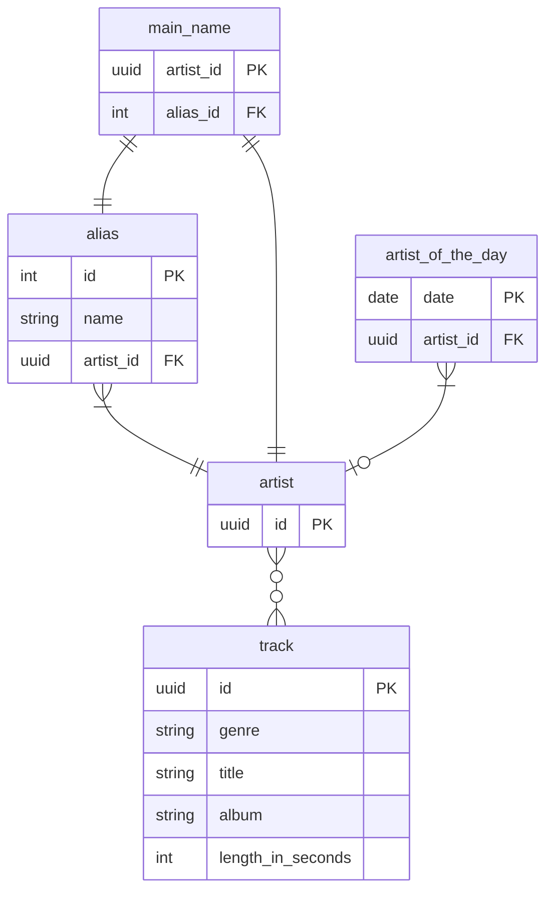

# Music Metadata Service

## API

APIs are defined in the OpenAPI format, Java classes for the API and API Models are generated from the spec. Documentation is available at 
https://carlo-colombo.github.io/mms/

## Requirements

* Java 17
* Docker for test containers

## Assumptions

* This service is called from other services, and authentication is built in the platform where these services are running.
* When an alias is added to an artist the alias became the new main name

## Implementation details

* UUID are used to identify artist and track instead of numerical id to avoid exposing information to the user of the service.
* the additional table `main_name` has been created to avoid circular dependency between `alias` and `artist`.

## Known issues

* When tracks are created they do not link back to artist. _Justification_: I set up a many-to-many relation between artists  and tracks as a track could have many artists and an artist could have multiple tracks, but I am not able to correctly configure the entities to have them save the intermediate table and I think I already invested enough time in understanding the issue and I think I can leave it out of the exercise in the spirit of limiting the time invested.
* Running tests requires to bring up a postgres container before being able to execute the tests. _Workaround_: run `./gradlew run` in another terminal to have a database running.

## How to run

To run against a test container just execute `./gradlew run`, to instead set the database
to an external database set the environment variables and run it.

```bash
export DATASOURCES_DEFAULT_USERNAME=postgres
export DATASOURCES_DEFAULT_PASSWORD=mysecretpassword
export DATASOURCES_DEFAULT_URL=jdbc:postgresql://localhost:5432/postgres
```

## Build images

* native (~115MB, Startup completed in 158ms) `./gradlew dockerBuildNative` (longer time to compile to native using GraalVM)
* jvm (~350MB, Startup completed in 1023ms ) `./gradlew dockerBuild`

### Run

```bash
export DATASOURCES_DEFAULT_USERNAME=postgres
export DATASOURCES_DEFAULT_PASSWORD=mysecretpassword
export DATASOURCES_DEFAULT_URL=jdbc:postgresql://localhost:5432/postgres

# exposes port 8080 as we are using postgres container network for the service as well
docker run -it -p 8080:8080 --rm --name some-postgres -e POSTGRES_PASSWORD=mysecretpassword postgres

docker run -it --rm --network=container:some-postgres -e DATASOURCES_DEFAULT_URL -e DATASOURCES_DEFAULT_USERNAME -e DATASOURCES_DEFAULT_PASSWORD metadata-music-service:latest
```

## How to run tests

`./gradlew run` to bring up a postgres testcontainer
`./gradlew test --rerun` (to always execute them)

## Database schema


